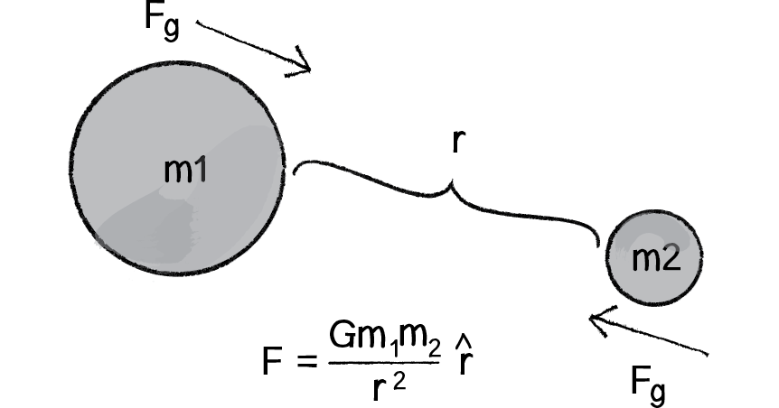

# Multiple forces

In this exercise we'll learn:

- How the combination of several forces acting simultaneously create complex motion.

- The meaning of *net force* and how to accumulate all forces acting over the particle before updating its position.

- Encapsulate our motion logic in a ```Particle``` object.

- Use ```ofParameter``` and ```ofxGui``` to expose parameters and experiment with their values.

- Code an ```Attractor``` class that calculates a [gravitational attraction force](https://natureofcode.com/book/chapter-2-forces/#chapter02_section9).

---

Gravitational attraction force:



---

### Resources:

[Forces chapter](https://natureofcode.com/book/chapter-2-forces/) from *The Nature of Code*
