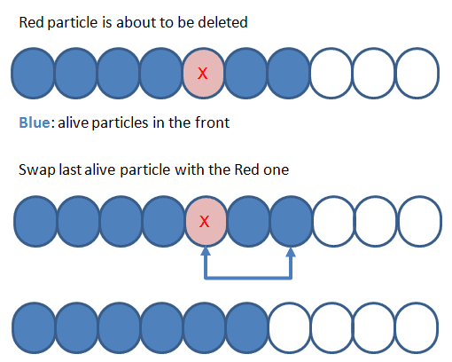

# Many particles (part 2): Particle pool

In the previous project we implemented a simple way of managing the creation and destruction of particles.
The solution was easy to implement and works for a small number of particles.

**Problems with the previous solution:**

- Memory has to be realocated every time a particle is added or removed. Realocating memory is slow.
- Won't scale well with a large number of particles.

**In this exercise we'll implement a ``ParticleData`` class that addresses this problems:**

- We'll allocate a big buffer only once with the maximum number of particles. All the particles will be in memory ready to be used. This is called an *object pool* pattern.

- This solves the allocation problem but we need a way to manage live/dead particles. The methods ``kill()`` and ``wake()`` will help managing the particles in memory. When a particle dies, it will be moved to the end, so the front of the buffer only contains alive particles. 

Implementing ``particlerData`` might seem overkill at this stage, but having our particles in a continous block of memory will increase performance when we use more advanced rendering techniques.

---
**Resources:**
https://www.bfilipek.com/2014/04/flexible-particle-system-container.html