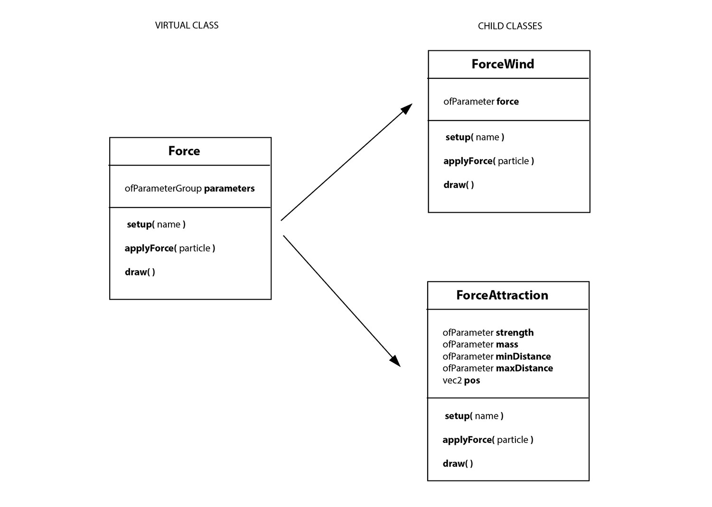

# OOP: Virtual force

Our system has the ability to add different types of forces. We achieve this using two powerful object oriented concepts: **inheritance** and **polymorphism**.

We'll create an **virtual ``Force`` class**: a class that only contains virtual method signatures (the interface).

Classes that inherit from the abstrat class (child classes) will have the same interface, but differrent implementation. 

We can have a *wind force* and an *attraction force*, but because they inherit from our base Force class and have the same interface, they are interchangeable. This is called polymorphism.

### What we are going to do:

1. Open the new ``Force`` virtual class and explain it. 
2. Make our ForceAttraction class inherit from Force.
3. Implement a new ``ForceWind`` class that inherits from ``Force``.
4. Refactor our ParticleSystem class so we can add any type of force instead of only ``ForceAttractor``. 
    - Due to polymorphism, we can now store diferent types of forces in the vector.
5. In ``ofApp``: create a new ``ForceWind`` and add it to the system.

### Resources:
[OOP Chapter from the *ofBook*](https://openframeworks.cc/ofBook/chapters/OOPs!.html)
